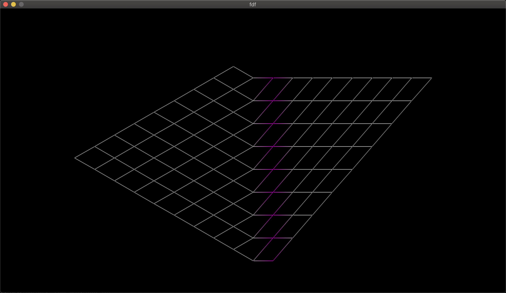
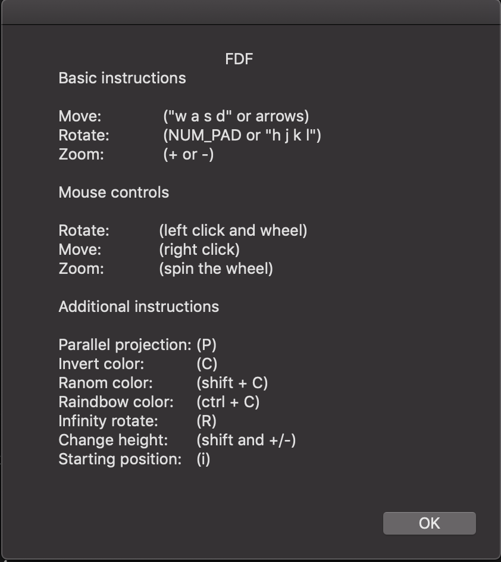

# fdf


The goal of the project is to create a program that will draw an isometric projection of this map using a height map

## Rules
The coordinates of the landscape are stored in a `*.fdf` file passed as a parameter to the program. Here is an example:
```
0 0 1,0xFF00FF 2 3 4 5 6 7 8 9
0 0 0 1,0xFF00FF 2 3 4 5 6 7 8
0 0 0 0 1,0xFF00FF 2 3 4 5 6 7
0 0 0 0 0 1,0xFF00FF 2 3 4 5 6
0 0 0 0 0 0 1,0xFF00FF 2 3 4 5
0 0 0 0 0 0 0 1,0xFF00FF 2 3 4
0 0 0 0 0 0 0 0 1,0xFF00FF 2 3
0 0 0 0 0 0 0 0 0 1,0xFF00FF 2
0 0 0 0 0 0 0 0 0 0 1,0xFF00FF
```


## Usage

To compile the progam you should do `./run.sh` for start default settings.

> After the launch `./run.sh` a window with management tips will appear, do not close it until you understand how everything works :D

You also have the opportunity to run `./fdf <path to *.fdf file>` to check how different maps will be displayed.

## Controls


